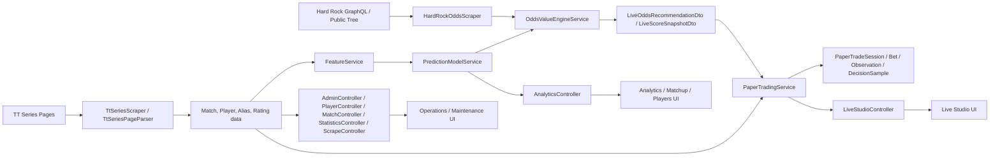

# Architecture Overview

TTLElite Series is organized around five major lanes. Each lane has a clear ownership area in the codebase.

## 1. Historical Data And Scraping

Purpose:
- ingest TT Series history
- parse structured results
- maintain scrape run/error telemetry

Primary code:
- [`/Users/alexcannon/Downloads/TTLEliteSeries/src/main/java/com/ttl/tabletennis/scrape/TtSeriesScraper.java`](../../src/main/java/com/ttl/tabletennis/scrape/TtSeriesScraper.java)
- [`/Users/alexcannon/Downloads/TTLEliteSeries/src/main/java/com/ttl/tabletennis/scrape/TtSeriesPageParser.java`](../../src/main/java/com/ttl/tabletennis/scrape/TtSeriesPageParser.java)
- [`/Users/alexcannon/Downloads/TTLEliteSeries/src/main/java/com/ttl/tabletennis/service/MatchResultBackfillService.java`](../../src/main/java/com/ttl/tabletennis/service/MatchResultBackfillService.java)
- [`/Users/alexcannon/Downloads/TTLEliteSeries/src/main/java/com/ttl/tabletennis/controller/ScrapeController.java`](../../src/main/java/com/ttl/tabletennis/controller/ScrapeController.java)

## 2. Player Identity, Ratings, And Features

Purpose:
- canonicalize players and aliases
- maintain Elo/Glicko snapshots
- build matchup feature vectors for pricing and analysis

Primary code:
- [`/Users/alexcannon/Downloads/TTLEliteSeries/src/main/java/com/ttl/tabletennis/service/PlayerIdentityService.java`](../../src/main/java/com/ttl/tabletennis/service/PlayerIdentityService.java)
- [`/Users/alexcannon/Downloads/TTLEliteSeries/src/main/java/com/ttl/tabletennis/service/TtSeriesEloSyncService.java`](../../src/main/java/com/ttl/tabletennis/service/TtSeriesEloSyncService.java)
- [`/Users/alexcannon/Downloads/TTLEliteSeries/src/main/java/com/ttl/tabletennis/service/Glicko2RatingService.java`](../../src/main/java/com/ttl/tabletennis/service/Glicko2RatingService.java)
- [`/Users/alexcannon/Downloads/TTLEliteSeries/src/main/java/com/ttl/tabletennis/service/FeatureService.java`](../../src/main/java/com/ttl/tabletennis/service/FeatureService.java)
- [`/Users/alexcannon/Downloads/TTLEliteSeries/src/main/java/com/ttl/tabletennis/service/MatchupAnalysisService.java`](../../src/main/java/com/ttl/tabletennis/service/MatchupAnalysisService.java)

## 3. Prediction, Value, And Live Board Generation

Purpose:
- train models
- create prediction snapshots
- compare model prices with sportsbook odds
- turn live data into recommendation rows

Primary code:
- [`/Users/alexcannon/Downloads/TTLEliteSeries/src/main/java/com/ttl/tabletennis/service/PredictionModelService.java`](../../src/main/java/com/ttl/tabletennis/service/PredictionModelService.java)
- [`/Users/alexcannon/Downloads/TTLEliteSeries/src/main/java/com/ttl/tabletennis/service/OddsValueEngineService.java`](../../src/main/java/com/ttl/tabletennis/service/OddsValueEngineService.java)
- [`/Users/alexcannon/Downloads/TTLEliteSeries/src/main/java/com/ttl/tabletennis/scrape/HardRockOddsScraper.java`](../../src/main/java/com/ttl/tabletennis/scrape/HardRockOddsScraper.java)
- [`/Users/alexcannon/Downloads/TTLEliteSeries/src/main/java/com/ttl/tabletennis/controller/AnalyticsController.java`](../../src/main/java/com/ttl/tabletennis/controller/AnalyticsController.java)

## 4. Live Studio And Paper Trading

Purpose:
- maintain the current simulated session
- track live/open bets
- store tracked score observations
- settle bets from live score, official result, or approved fallback paths

Primary code:
- [`/Users/alexcannon/Downloads/TTLEliteSeries/src/main/java/com/ttl/tabletennis/service/PaperTradingService.java`](../../src/main/java/com/ttl/tabletennis/service/PaperTradingService.java)
- [`/Users/alexcannon/Downloads/TTLEliteSeries/src/main/java/com/ttl/tabletennis/service/PaperTradingScheduler.java`](../../src/main/java/com/ttl/tabletennis/service/PaperTradingScheduler.java)
- [`/Users/alexcannon/Downloads/TTLEliteSeries/src/main/java/com/ttl/tabletennis/controller/LiveStudioController.java`](../../src/main/java/com/ttl/tabletennis/controller/LiveStudioController.java)
- [`/Users/alexcannon/Downloads/TTLEliteSeries/src/main/java/com/ttl/tabletennis/domain/PaperTradeBet.java`](../../src/main/java/com/ttl/tabletennis/domain/PaperTradeBet.java)
- [`/Users/alexcannon/Downloads/TTLEliteSeries/src/main/java/com/ttl/tabletennis/domain/TrackedMatchObservation.java`](../../src/main/java/com/ttl/tabletennis/domain/TrackedMatchObservation.java)

## 5. Product UI, Analytics, And Operations

Purpose:
- expose live studio, players, matchup, analytics, and ops pages
- provide operator actions and visibility
- provide release-gate and smoke scripts

Primary code:
- [`/Users/alexcannon/Downloads/TTLEliteSeries/web/src/app/router.tsx`](../../web/src/app/router.tsx)
- [`/Users/alexcannon/Downloads/TTLEliteSeries/web/src/components/AppShell.tsx`](../../web/src/components/AppShell.tsx)
- [`/Users/alexcannon/Downloads/TTLEliteSeries/web/src/pages`](../../web/src/pages)
- [`/Users/alexcannon/Downloads/TTLEliteSeries/scripts`](../../scripts)

## High-Level System Diagram

## Boot And Runtime Entry Points

Application startup:
- [`/Users/alexcannon/Downloads/TTLEliteSeries/src/main/java/com/ttl/tabletennis/TtlEliteSeriesApplication.java`](../../src/main/java/com/ttl/tabletennis/TtlEliteSeriesApplication.java)

Important boot behavior:
- ensures a local datasource default exists
- falls back to in-memory H2 if the local file DB is locked
- can auto-start the scraper
- can auto-run Elo sync
- can bootstrap Glicko ratings if missing

Frontend startup:
- [`/Users/alexcannon/Downloads/TTLEliteSeries/web/src/main.tsx`](../../web/src/main.tsx)
- [`/Users/alexcannon/Downloads/TTLEliteSeries/web/src/app/router.tsx`](../../web/src/app/router.tsx)
- [`/Users/alexcannon/Downloads/TTLEliteSeries/web/src/lib/api.ts`](../../web/src/lib/api.ts)
