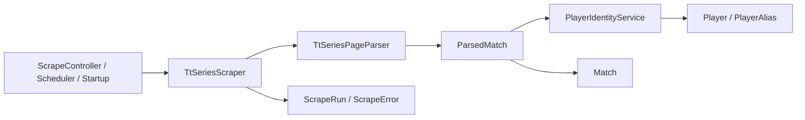
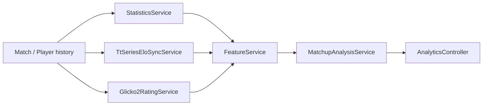
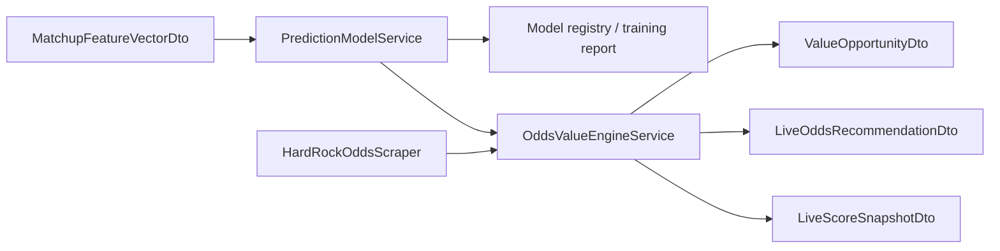
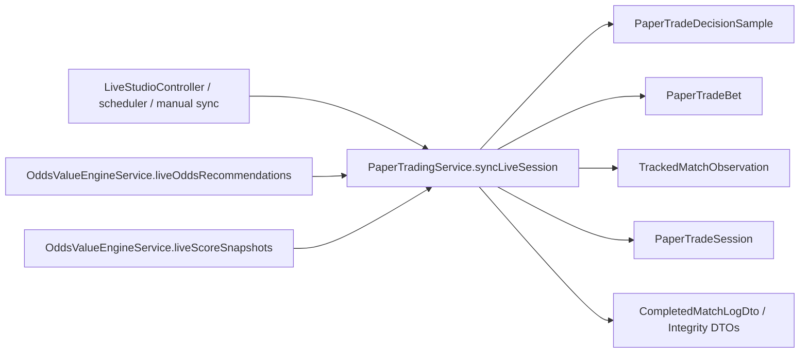
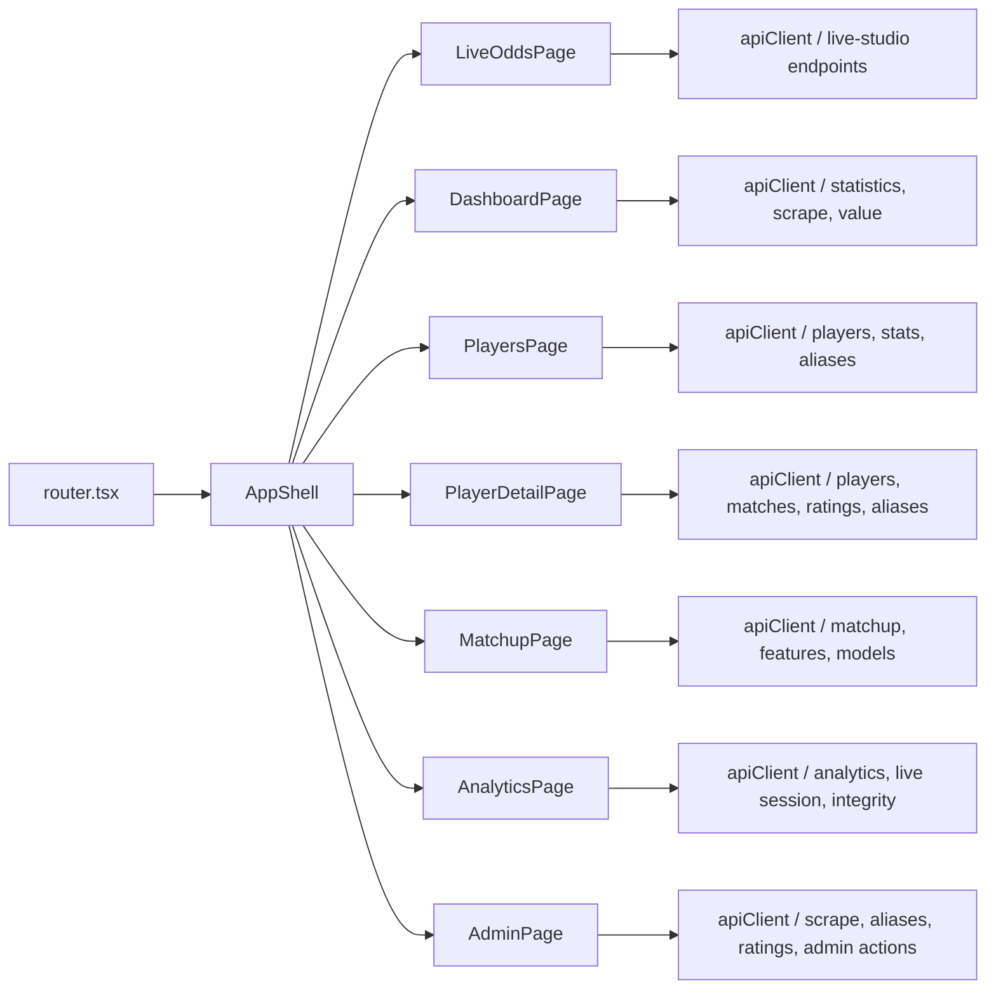

# Runtime Flows

This page maps the main end-to-end flows in the system so you can debug behavior by following the owning classes instead of searching the whole repo.

## Flow 1: Historical Scrape To Canonical Match Data

Files:
- [`/Users/alexcannon/Downloads/TTLEliteSeries/src/main/java/com/ttl/tabletennis/controller/ScrapeController.java`](../../src/main/java/com/ttl/tabletennis/controller/ScrapeController.java)
- [`/Users/alexcannon/Downloads/TTLEliteSeries/src/main/java/com/ttl/tabletennis/scrape/TtSeriesScraper.java`](../../src/main/java/com/ttl/tabletennis/scrape/TtSeriesScraper.java)
- [`/Users/alexcannon/Downloads/TTLEliteSeries/src/main/java/com/ttl/tabletennis/scrape/TtSeriesPageParser.java`](../../src/main/java/com/ttl/tabletennis/scrape/TtSeriesPageParser.java)
- [`/Users/alexcannon/Downloads/TTLEliteSeries/src/main/java/com/ttl/tabletennis/service/PlayerIdentityService.java`](../../src/main/java/com/ttl/tabletennis/service/PlayerIdentityService.java)

## Flow 2: Ratings And Matchup Features

Files:
- [`/Users/alexcannon/Downloads/TTLEliteSeries/src/main/java/com/ttl/tabletennis/service/StatisticsService.java`](../../src/main/java/com/ttl/tabletennis/service/StatisticsService.java)
- [`/Users/alexcannon/Downloads/TTLEliteSeries/src/main/java/com/ttl/tabletennis/service/TtSeriesEloSyncService.java`](../../src/main/java/com/ttl/tabletennis/service/TtSeriesEloSyncService.java)
- [`/Users/alexcannon/Downloads/TTLEliteSeries/src/main/java/com/ttl/tabletennis/service/Glicko2RatingService.java`](../../src/main/java/com/ttl/tabletennis/service/Glicko2RatingService.java)
- [`/Users/alexcannon/Downloads/TTLEliteSeries/src/main/java/com/ttl/tabletennis/service/FeatureService.java`](../../src/main/java/com/ttl/tabletennis/service/FeatureService.java)
- [`/Users/alexcannon/Downloads/TTLEliteSeries/src/main/java/com/ttl/tabletennis/service/MatchupAnalysisService.java`](../../src/main/java/com/ttl/tabletennis/service/MatchupAnalysisService.java)

## Flow 3: Model Training And Value Generation

Files:
- [`/Users/alexcannon/Downloads/TTLEliteSeries/src/main/java/com/ttl/tabletennis/service/PredictionModelService.java`](../../src/main/java/com/ttl/tabletennis/service/PredictionModelService.java)
- [`/Users/alexcannon/Downloads/TTLEliteSeries/src/main/java/com/ttl/tabletennis/service/OddsValueEngineService.java`](../../src/main/java/com/ttl/tabletennis/service/OddsValueEngineService.java)
- [`/Users/alexcannon/Downloads/TTLEliteSeries/src/main/java/com/ttl/tabletennis/scrape/HardRockOddsScraper.java`](../../src/main/java/com/ttl/tabletennis/scrape/HardRockOddsScraper.java)

## Flow 4: Live Studio Sync And Paper Trading

Files:
- [`/Users/alexcannon/Downloads/TTLEliteSeries/src/main/java/com/ttl/tabletennis/service/PaperTradingService.java`](../../src/main/java/com/ttl/tabletennis/service/PaperTradingService.java)
- [`/Users/alexcannon/Downloads/TTLEliteSeries/src/main/java/com/ttl/tabletennis/controller/LiveStudioController.java`](../../src/main/java/com/ttl/tabletennis/controller/LiveStudioController.java)
- [`/Users/alexcannon/Downloads/TTLEliteSeries/src/main/java/com/ttl/tabletennis/service/PaperTradingScheduler.java`](../../src/main/java/com/ttl/tabletennis/service/PaperTradingScheduler.java)

## Flow 5: Settlement Truth

Settlement is the highest-risk flow in the codebase because it decides win/loss outcome and learning inputs.

Priority order today:

1. tracked live score / targeted completion evidence
2. official result confirmation
3. approved fallback paths
4. void as last resort

Files:
- [`/Users/alexcannon/Downloads/TTLEliteSeries/src/main/java/com/ttl/tabletennis/service/PaperTradingService.java`](../../src/main/java/com/ttl/tabletennis/service/PaperTradingService.java)
- [`/Users/alexcannon/Downloads/TTLEliteSeries/src/main/java/com/ttl/tabletennis/domain/TrackedMatchObservation.java`](../../src/main/java/com/ttl/tabletennis/domain/TrackedMatchObservation.java)
- [`/Users/alexcannon/Downloads/TTLEliteSeries/src/main/java/com/ttl/tabletennis/domain/PaperTradeBet.java`](../../src/main/java/com/ttl/tabletennis/domain/PaperTradeBet.java)
- [`/Users/alexcannon/Downloads/TTLEliteSeries/docs/ttlelite-series-2.0/TTLElite-Series-2.0-Run-56-Bug-Closure-Plan.md`](../ttlelite-series-2.0/TTLElite-Series-2.0-Run-56-Bug-Closure-Plan.md)

## Flow 6: Frontend Product Surfaces

Files:
- [`/Users/alexcannon/Downloads/TTLEliteSeries/web/src/app/router.tsx`](../../web/src/app/router.tsx)
- [`/Users/alexcannon/Downloads/TTLEliteSeries/web/src/components/AppShell.tsx`](../../web/src/components/AppShell.tsx)
- [`/Users/alexcannon/Downloads/TTLEliteSeries/web/src/lib/api.ts`](../../web/src/lib/api.ts)
- [`/Users/alexcannon/Downloads/TTLEliteSeries/web/src/pages`](../../web/src/pages)
