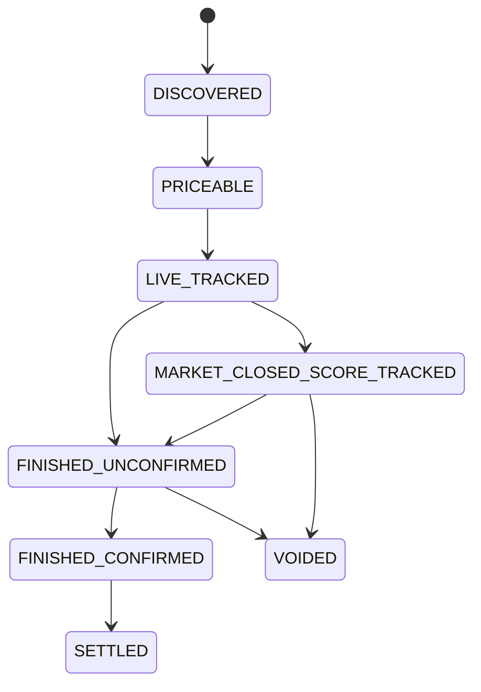
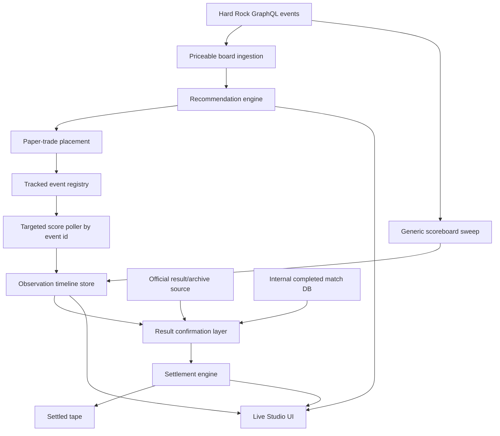

# TTLElite Series 2.0 Live Data Architecture

## Architectural Goal

The live system must continue to know what is happening in a match even when the sportsbook no longer wants to price that match.

That means TTLElite 2.0 needs to separate:

- `market visibility`
- `score continuity`
- `result confirmation`
- `settlement decision`

## Why This Architecture Exists

The live product currently has two related but different jobs:

1. discover value opportunities while a market is priceable
2. continue observing a tracked match until its result is trustworthy enough to settle

Those jobs overlap, but they are not the same job.

A sportsbook can stop pricing an event before the event is actually over. When that happens, TTLElite should keep following the match if upstream score evidence still exists.

This architecture is consistent with:

- the official [ITTF Handbook](https://db.ittf.com/sites/default/files/public/2021-08/2021ITTFHandbook_v2_clean_version_1.pdf), which is the baseline scoring reference for final-state inference policy
- Hard Rock Bet's [live betting](https://www.hardrock.bet/sportsbook/live-betting/) and [table tennis](https://www.hardrock.bet/sportsbook/table-tennis/) product surfaces, which reinforce that live market visibility is a sportsbook presentation layer, not a guarantee of uninterrupted score visibility inside the same row

## Current Code Reality

### What already exists

The current code already contains the beginnings of the target architecture:

- board/recommendation polling:
  - `/Users/alexcannon/Downloads/TTLEliteSeries/src/main/java/com/ttl/tabletennis/service/OddsValueEngineService.java`
  - `liveOddsRecommendations(...)`
- generic score polling:
  - `liveScoreSnapshots(...)`
- targeted score polling by event id:
  - `liveScoreSnapshotsForEventIds(...)`
- targeted scoreboard fetch in scraper:
  - `/Users/alexcannon/Downloads/TTLEliteSeries/src/main/java/com/ttl/tabletennis/scrape/HardRockOddsScraper.java`
  - `fetchScoreboardByEventIds(...)`
- observation persistence:
  - `/Users/alexcannon/Downloads/TTLEliteSeries/src/main/java/com/ttl/tabletennis/domain/TrackedMatchObservation.java`
- settlement metadata on bets:
  - `/Users/alexcannon/Downloads/TTLEliteSeries/src/main/java/com/ttl/tabletennis/domain/PaperTradeBet.java`
- dedicated Live Studio API:
  - `/Users/alexcannon/Downloads/TTLEliteSeries/src/main/java/com/ttl/tabletennis/controller/LiveStudioController.java`

### What is still weak

- public-tree scoreboard parsing still assumes event arrays in places where current payloads can return `events: { count: N }`
- the product has score timelines, but the user experience does not yet fully center them
- lifecycle state still needs to become more explicit and less heuristic-driven
- source health and source confidence still need stronger first-class treatment

## 2.0 Architecture Principles

- odds visibility is not the same as score visibility
- score continuity is an event-monitoring concern, not just a betting-row concern
- settlement should consume a timeline, not a single latest row
- source ranking should be explicit and persisted
- lifecycle state should be inspectable, not inferred only by reading logs

## Source Hierarchy

### Source A: Priceable live event feed

Purpose:

- discover live rows
- discover market state
- discover odds
- extract embedded score when available

Current implementation anchor:

- `HardRockOddsScraper.fetch()`
- `OddsValueEngineService.liveOddsRecommendations(...)`

### Source B: Tracked-event score feed

Purpose:

- continue observing open or watched matches even when not priceable
- keep score snapshots and timestamps alive until finish confidence is high

Current implementation anchor:

- `HardRockOddsScraper.fetchScoreboardByEventIds(...)`
- `OddsValueEngineService.liveScoreSnapshotsForEventIds(...)`

This is the most important 2.0 reliability layer.

### Source C: Generic scoreboard feed

Purpose:

- provide a broad live scoreboard sweep for currently visible matches
- cross-check board rows and tracked-event rows

Current implementation anchor:

- `HardRockOddsScraper.fetchScoreboard()`
- `OddsValueEngineService.liveScoreSnapshots(...)`

### Source D: Official result/archive feed

Purpose:

- confirm winner/loser when a more authoritative result source exists
- backfill late confirmation when live continuity was imperfect

Target implementation anchor:

- result/archive ingestion service or scraper backfill path

### Source E: Internal completed match database

Purpose:

- reconcile a tracked bet to an internal completed match with high confidence

Current implementation anchor:

- `MatchRepository`
- settlement fallback logic in `PaperTradingService`

### Source F: Heuristic last-score fallback

Purpose:

- resolve only when policy allows and stronger evidence failed

This should remain the weakest and least common settlement path.

## Observation Model

Each tracked match should have a persistent observation timeline.

### Observation record requirements

Each observation should carry:

- stable tracked event identity
- source type
- source confidence
- observed time
- whether the source was post-market-close
- event/market state
- set score
- point score
- per-game scores if available
- raw score display
- raw source evidence or parse-ready fragments

### Current persistence anchor

- `/Users/alexcannon/Downloads/TTLEliteSeries/src/main/java/com/ttl/tabletennis/domain/TrackedMatchObservation.java`
- `/Users/alexcannon/Downloads/TTLEliteSeries/src/main/java/com/ttl/tabletennis/repository/TrackedMatchObservationRepository.java`

### Recommended addition

If lifecycle state becomes too expensive to recompute from snapshots on every request, add a companion `TrackedEventState` entity that stores:

- latest lifecycle state
- last board observation time
- last tracked score observation time
- last authoritative confirmation time
- current source health
- staleness flags

## Stable Identity Strategy

Every tracked match should use a ranked identity strategy:

1. sportsbook external event id
2. upstream source feed event id from `matchState`
3. normalized matchup key
4. scheduled start window
5. canonical player ids when resolved

Identity confidence should be persisted and surfaced in the UI when it is not high.

## Recommended Lifecycle State Machine

### State intent

- `DISCOVERED`: match is known but not yet trusted enough for action
- `PRICEABLE`: market row exists and can be priced
- `LIVE_TRACKED`: bet or watch registration exists and score is being observed live
- `MARKET_CLOSED_SCORE_TRACKED`: market row is gone, but score continuity is still alive
- `FINISHED_UNCONFIRMED`: match appears complete but confirmation tier is not yet strong enough
- `FINISHED_CONFIRMED`: authoritative enough to settle
- `SETTLED`: final portfolio action taken
- `VOIDED`: all stronger resolution paths failed within policy

## Live Data Flow

## Settlement Decision Policy

### Strong settlement sources

- explicit completed/result source with winner confirmation
- explicit `matchCompleted` plus decisive score structure
- official result/archive source
- high-confidence internal DB match reconciliation

### Medium settlement sources

- decisive tracked score from post-close score polling
- finished live score captured before source disappearance

### Weak settlement sources

- heuristic last-score inference without authoritative finish confirmation

### Void condition

Void only when:

- strong and medium confirmation paths fail
- identity cannot be resolved safely enough
- timeout policy is exhausted

## Public Tree Role In 2.0

The public tree should be downgraded from “main scoreboard fallback” to:

- TTL competition discovery
- source health/sanity checks
- secondary evidence
- parser drift detection

It should not be the sole dependency for end-of-match score continuity unless future upstream evidence proves it can reliably serve that role.

## Required Backend Changes

### Scraper layer

- separate priceable-event polling from tracked-event score polling conceptually and in diagnostics
- rework current public-tree parsing for `events.count` style responses
- preserve raw source identifiers and parse-quality markers

### Service layer

- keep tracked-event registry for all open bets and watched matches
- feed settlement from observation history, not from the latest visible board row
- expose source confidence and staleness in DTOs

### Domain layer

- persist tracked observations
- optionally add tracked-event state
- persist settlement provenance and lifecycle state cleanly

## Required Frontend Changes

### Live Studio

For each open position, show:

- last score
- last score update time
- source label
- tracked-after-close badge
- settlement readiness / unsettled reason

### Settled tape

For each settled bet, show:

- final score
- winner
- settlement source
- settlement reason
- whether the result was authoritative or fallback

### Integrity panel

Show current-session counts for:

- score-backed settlements
- official-result settlements
- database settlements
- heuristic fallbacks
- timeout voids
- tracked-after-close open positions
- stale tracked matches

## Test Strategy

### Source contract tests

Use captured payloads for:

- GraphQL events feed
- GraphQL scoreboard-by-event-id feed
- public-tree current response shapes
- `matchState` variants with set score, point score, and completion flags

### Replay tests

Replay real sequences for:

- market stays open to completion
- market closes early but score continues
- event disappears and later reappears
- duplicate player-name variants
- late internal DB reconciliation
- stale post-close tracking that should remain open instead of voiding early

### UI tests

- open positions retain tracked state after market close
- timeline view shows score observation history
- settled tape shows source and reason correctly
- integrity panel counts match backend source counts

## Definition Of Done

The live-data architecture is complete when a tracked paper-trade position can move from:

- visible live market
- to market closed but score still tracked
- to confirmed result
- to settled tape

without blind timeout settlement being the normal path.
